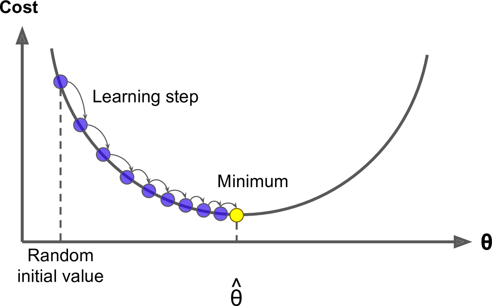
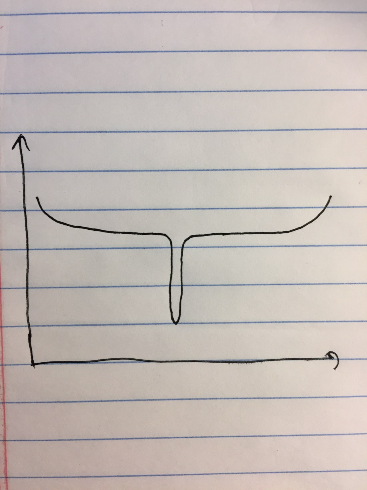
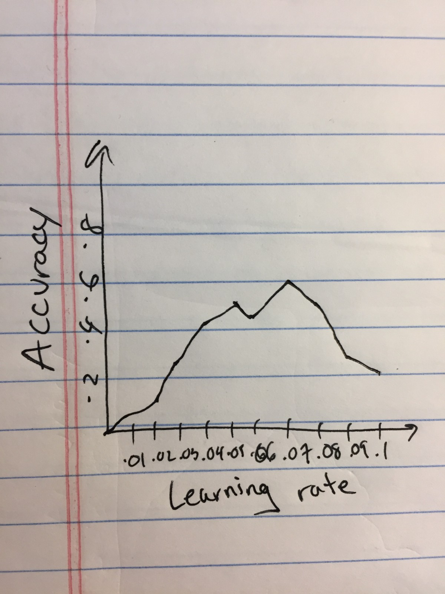

# Deep Neural Networks: Choosing a Learning Rate

### Original Paper: [Cyclical Learning Rates for Training Neural Networks](https://arxiv.org/abs/1506.01186) by Leslie Smith

## Motivation

One of the most arduous tasks of training a deep neural network is picking the learning rate(LR). Often this is done crudely. Pick a value and see how it does. Repeat until you find good results or are sufficiently frustrated. You are always trading off the speed with which you get results back and the number of iterations to perform. It is hard to know whether suboptimal results could be improved by increasing the number of iterations or changing the learning rate. In this paper, the author introduces cyclical learning rates, a method by which the learning rate changes during training. The author shows that this often performs better than a static value, and drastically reduces the time required to get optimal results.
"this cyclical learning rate (CLR) method practically eliminates the need to tune the learning rate yet achieves near optimal classification accuracy."

## Inspiration

In a classical gradient descent problem, one often fears the local minimum. However, stochastic gradient descent (SGD) solves this pretty well. The author suggests that intuitively, CLR succeeds because of the way it combats saddles.
"Saddle points have small gradients that slow the learning process. However, increasing the learning rate allows more rapid traversal of saddle point plateaus."
For instance consider stochastic gradient descent on the following function, which contains two large saddle points.

If your learning rate and iteration size are too small, you would get stuck on the plateaus of the saddle points. Even if you tried randomly restarting as one does in stochastic gradient descent, you would likely still miss the minima unless you spawned there.
Adaptive Learning Rates
Your first idea might be to try and adapt your learning rate based on the current slope. This is a good idea. In the related work section, the author references several previous works using an adaptive learning rate that improves accuracy. However, most of these come at significant computational cost, and therefore time. CLR is different in that the computation cost is negligible (you just alter the rate by a constant value), yet it provides the same benefits.

## Triangular Method

The author first presents a simple solution- linearly increase and decrease the learning rate between two bounds. The example above highlights the success of this approach. You would be able to speed up over the plateau, and slow down during the middle peak. However, it can be challenging to choose the bounds. The author suggests the following LR range test- run for many values and plot accuracy against LR. Imagine you get the following plot

The optimal learning rate is usually when the accuracy is increasing the most. In our example, thats between .02 and .05. So, take those as your minimum and maximum LR values.

## Tuning

Unfortunately the simplest solution does not perform the best. The author presents the above method as the triangular learning rate policy, and presents two more. Triangular2 is roughly the same, but at the end of each cycle the learning rate difference is cut in half. This has the effect of bringing the learning rates closer and closer to a singular value when, in theory, you are closer and closer to the minimum. Exp_range varies the learning rate geometrically, rather than linearly. This has the effect of spending more time at the boundaries, rather than a uniform distribution across the range.

## Results

The author runs this method against several existing benchmarks, including some adaptive learning rate methods. Overall CLR does at least as good as adaptive methods, and often times in a fraction of the number of iterations. For the times where it requires as many iterations, it at least does not have the large computation cost of determining the current learning rate.

## Conclusion

This paper presents an extremely practical approach to determining the appropriate learning rate in a deep neural network. This approach eliminates a lot of the guesswork and attains optimal results, often in significantly less time.
