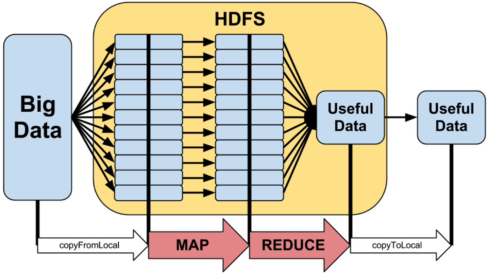

# MapReduce: Simplified Data Processing on Large Clusters

### Original Paper: [MapReduce: Simplified Data Processing on Large Clusters](https://static.googleusercontent.com/media/research.google.com/en//archive/mapreduce-osdi04.pdf) by Jeffrey Dean and Sanjay Ghemawat, Google, Inc.



## Introduction

With MapReduce, Google created a new domain of programming. The authors first present an interface for dealing with data that can be run in a distributed fashion. Then they provide details of Google's implementation, which handles many of the complexities of distributed systems behind the scenes. The authors sum up the point of their work nicely:
"MapReduce has been so successful because it makes it possible to write a simple program and run it efficiently on a thousand machines in the course of half an hour, greatly speeding up the development and prototyping cycle. Furthermore, it allows programmers who have no experience with distributed and/or parallel systems to exploit large amounts of resources easily."
In this summary, I will focus on the programming model. Equally important to the scope of this paper is the implementation details. For those of you with a curiosity for distributed systems, I encourage you to read the paper in its entirety.

## Programming Model

The MapReduce job will transform a list of input key/values to a list of output key/values. An important note is that the sizes of the lists are not necessarily the same:
MapReduce: list(k1,v1) -> list(k2,v2)
Not surprisingly, the programming model consists of two important parts: map and reduce. The mapper transforms an input key/value pair and produces a list of intermediate key/values

```
Map: (k1,v1) -> list(k2,v2)
```

The reducer takes an intermediate key and a list of intermediate values, and produces an output list. Typically zero or one value is the product, however size of the output list can be as large as the size of the input:
Reduce: (k2,list(v2)) -> list(v2)
The most important aspect of this programming model is that data can be processed in parallel. Each mapper works with a single input record. Each reducer works with at most the size of the intermediate list(v2). Let's take a look at the hello world of distributed data processing to make this a bit more concrete.

### Word Count

Consider a set of documents (perhaps the entire internet). We would like to count the frequency of words across the internet. To give a bit more context, let's first take a look at the simple single machine solution.

```
public Map<String, Integer> countWords(List<String> inputs) {
  Map<String, Integer> wordCounts = new HashMap<>();
    for (String input: inputs) {
      String[] words = input.split[" "];
      for (String word: words) {
        if (wordCounts.contains(word)) {
          wordCounts.put(word, wordCounts.get(word) + 1);
        } else {
          wordCounts.put(word, 1);
        }
      }
    }
  return wordCounts;
}
```

This works great until you have billions of input strings. Ok, perhaps you could stream in the inputs in batches, perhaps a document at a time. But what if the dictionary that you are compiling is also too big to fit into memory? This now becomes much harder. You have to partition the data somehow… enter MapReduce!

```
// key is the document name, unnecessary in this example
// value is the document
public void map(String key, String value) {
  // A naive technique to determine words in a document
  String[] words = value.split[" "];
  for (String word: words) {
    // emit is a function provided by the framework. This will write
    // the key/value to the proper file location
    emitIntermediate(word, "1");
  }
}
// Key is the word
// list of values are the "1"s for every occurance
public void reduce(String key, Iterator<String> values) {
  int result = 0;
  for (String value: values) {
  result += Integer.parseInt(value);
  }
  // At this point the result properly reflects the number of
  // occurrences for this word
  emitResult(key, result.toString());
}
emit()
```

A little bit more on emit. Emit is how you produce at each step. In the mapper, emitIntermediate() will write the parameters to files. The framework ensures that values with the same keys are written to the same location so that the reducer can properly read all the values with the same key. emitResult() will write the key/value pairs(s) to an output file. At this point you have successfully compiled a list of unique words, and their corresponding values across the entire internet!

## So what

Once again, best summed up by the authors:

> "The model is easy to use, even for programmers without experience with parallel and distributed systems, since it hides the details of parallelization, fault-tolerance, locality optimization, and load balancing."

MapReduce gives programmers the power of distributed computing, with the knowledge of a simple programming interface. The fact that I yet to mention a lot of those big words ("fault-tolerance", "locality optimization", etc.) shows how powerful a concept this is!

#### Hadoop

Equally as important as the programming model was the detailed implementation that Google has constructed to run MapReduce. Solving problems like fault-tolerance is not easy. A year after this paper was published, Apache Hadoop was created with the same programming interface and a similar implementation. With Hadoop, software engineers outside Google's walls were able to easily process data at scale.
